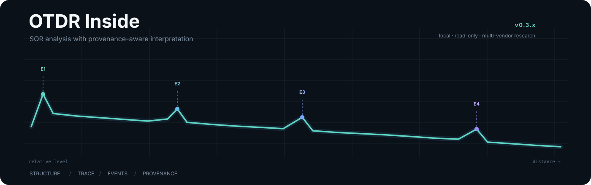
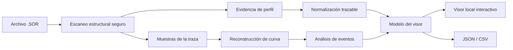

<p align="center">
  
</p>

<h1 align="center">OTDR Inside</h1>

<p align="center">
  <strong>Lee la traza. Sigue la evidencia.</strong>
</p>

<p align="center">
  Una herramienta local y orientada a evidencia para leer archivos OTDR SOR, reconstruir trazas y separar claramente lo almacenado, lo interpretado y lo calculado.
</p>

<p align="center">
  <a href="README.md">English</a> · <strong>Español</strong>
</p>

<p align="center">
  <code>lectura SOR</code> · <code>trazas OTDR</code> · <code>análisis de eventos</code> · <code>procedencia</code> · <code>multifabricante</code> · <code>procesamiento local</code>
</p>

---

## Una misma traza puede contar historias distintas

Graficar una curva OTDR es la parte fácil.

Lo difícil es decidir qué información puede considerarse realmente confiable.

Los archivos SOR reales pueden contener bloques estándar, extensiones propietarias, metadatos añadidos por software, escalas ambiguas e información de eventos que cambia según el ecosistema que escribió o interpretó posteriormente el archivo.

**OTDR Inside se construye alrededor de una regla:** ninguna interpretación debe presentarse como más sólida que la evidencia que la respalda.

Por eso el proyecto mantiene deliberadamente separados estos conceptos:

```text
estructura del archivo      ≠ significado semántico
equipo de adquisición       ≠ software que escribió el archivo
valor almacenado            ≠ valor mostrado
evento almacenado           ≠ evento calculado
desconocido                 ≠ corrupto
```

Esta distinción es el núcleo del proyecto.

---

## Qué hace OTDR Inside

OTDR Inside transforma un archivo SOR en una cadena de análisis inspeccionable:



### Capacidades principales

| Capacidad | Qué significa en la práctica |
|---|---|
| **Escaneo SOR seguro** | Lee bloques, revisiones, tamaños y offsets con comprobaciones de límites en lugar de confiar ciegamente en el archivo. |
| **Identificación basada en evidencia** | Usa varias señales para caracterizar perfiles y linajes de software/fabricante en vez de decidir por una sola cadena o bloque. |
| **Normalización trazable** | Conserva juntos el valor crudo, el valor interpretado, la fuente, la regla aplicada y el nivel de confianza. |
| **Reconstrucción de traza** | Recupera las muestras OTDR y construye el eje de distancia utilizado por el visor y el análisis. |
| **Análisis de eventos con procedencia** | Mantiene diferenciados los eventos almacenados y los candidatos calculados, en lugar de mezclarlos en una sola tabla sin contexto. |
| **Visor local** | Presenta curva, parámetros, estructura, procedencia y eventos sin enviar trazas operativas a un servicio externo. |
| **Exportación** | Genera salidas JSON y CSV para análisis posterior sin modificar el archivo SOR original. |

---

## La evidencia también forma parte del dato

Un campo normalizado no se trata simplemente como un número.

```python
normalized_field = {
    "value": ...,
    "raw_value": ...,
    "unit": ...,
    "source": ...,
    "rule_id": ...,
    "confidence": ...,
    "evidence": ...
}
```

Así se evita que una conversión empírica, una escala específica de fabricante o una interpretación inferida terminen siendo indistinguibles de un dato almacenado explícitamente en el archivo.

La implementación sigue cuatro reglas prácticas:

- **Leer de forma segura.** Una estructura incompleta o malformada debe producir un diagnóstico, no corrupción silenciosa.
- **Preservar la evidencia.** La normalización no debe borrar la representación original.
- **Interpretar por perfil, no por parecido.** Un único marcador propietario no basta para establecer procedencia.
- **Desconocido es un resultado válido.** Si una interpretación semántica todavía no puede demostrarse, el software debe decirlo.

---

## Línea actual de desarrollo

La línea de desarrollo actual es **v0.3.x**.

A esta altura, el proyecto ya no es únicamente un lector SOR. Integra análisis estructural, interpretación dependiente de perfil, reconstrucción de curva, procedencia y análisis orientado a eventos.

El trabajo actual de investigación y validación ha cubierto archivos asociados con varios ecosistemas OTDR:

| Ecosistema | Papel actual dentro del proyecto |
|---|---|
| **EXFO** | Referencia principal validada para lectura SOR 2.00, parámetros normalizados, eventos almacenados y visualización de trazas. |
| **Ceyear CE6422** | Línea activa de interpretación de curva y detección de candidatos de evento cuando el SOR no contiene `KeyEvents`. |
| **Yokogawa AQ1000** | Caracterización estructural disponible; la normalización semántica específica del fabricante queda para una etapa posterior. |

El soporte no se reduce deliberadamente a una etiqueta de “sí/no”. Un archivo puede ser estructuralmente legible aunque algunas magnitudes específicas del fabricante sigan sin estar validadas.

```text
ESTRUCTURALMENTE LEGIBLE
           ↓
PERFIL IDENTIFICADO
           ↓
CARACTERIZADO SEMÁNTICAMENTE
           ↓
VALIDADO EMPÍRICAMENTE
```

---

## Por qué la capa de eventos importa

Uno de los cambios más importantes de la línea actual es la separación explícita de la **procedencia de los eventos**.

Un evento mostrado dentro de un flujo OTDR puede provenir de distintas fuentes:

- estar almacenado directamente en el archivo SOR,
- ser calculado a partir de la curva reconstruida,
- ser importado desde otro formato de fabricante,
- o eventualmente ser añadido manualmente durante una revisión.

OTDR Inside no supone que esas fuentes sean equivalentes.

Por ejemplo, algunos archivos Ceyear SOR utilizados durante el desarrollo no incluyen `KeyEvents`. La conclusión correcta no es “no existen eventos”, sino **“el SOR no contiene una tabla de eventos almacenada”**. La línea actual añade candidatos obtenidos desde la curva manteniendo explícito su origen calculado.

---

## Local y de solo lectura por diseño

Las trazas OTDR operativas pueden contener información que no debe convertirse en datos públicos.

Por esta razón, el analizador está pensado para trabajar localmente y tratar los archivos originales como entradas de solo lectura. El flujo normal analiza copias temporales en vez de sobrescribir la medición original.

Por tanto, este repositorio **no distribuye**:

- archivos operativos reales `.sor`, `.ei` u `.otdr`,
- identificadores de clientes o rutas,
- ejecutables propietarios de fabricantes,
- manuales comerciales,
- estándares técnicos licenciados,
- ni archivos derivados que expongan metadatos confidenciales de las trazas.

Los ejemplos públicos y las pruebas automatizadas deben usar datos sintéticos o explícitamente anonimizados.

---

## La arquitectura en una frase

**Primero la estructura, después la interpretación y siempre la confianza asociada.**

El proyecto separa deliberadamente el análisis binario de bajo nivel de la semántica específica de fabricante. Así, un archivo desconocido puede seguir siendo inspeccionado sin fingir que cada campo ya fue comprendido.

---

## Lo que este proyecto no afirma

OTDR Inside es un prototipo de ingeniería e investigación.

No afirma compatibilidad universal con todas las implementaciones SOR ni certificación independiente de conformidad con Telcordia SR-4731.

Las interpretaciones específicas de fabricante solo se promueven cuando existe evidencia reproducible suficiente para explicar por qué se consideran confiables.

---

## Enfoque de validación

El proyecto usa varias capas de validación en lugar de una sola prueba de “funciona/no funciona”:

```text
fixtures sintéticos o anonimizados
              ↓
pruebas de parser y límites
              ↓
regresión de perfiles
              ↓
reconstrucción de traza
              ↓
comparación con herramientas de referencia
              ↓
validación manual del visor
```

Las trazas operativas utilizadas durante la validación permanecen fuera del repositorio público.

---

## Aspectos de ingeniería destacados

- Lectura defensiva de estructuras binarias con comprobación explícita de límites.
- Conservación de bloques desconocidos y propietarios en vez de descartarlos silenciosamente.
- Selección de perfiles basada en evidencia.
- Normalización con procedencia y nivel de confianza.
- Reconstrucción de curvas OTDR desde las muestras almacenadas.
- Separación explícita entre información de eventos almacenada y calculada.
- Visualización local interactiva.
- Degradación segura ante variantes parcialmente soportadas.
- Exportación JSON y CSV para análisis posterior.
- Desarrollo orientado a regresión sobre variantes reales sin publicar las mediciones operativas subyacentes.

---

## Hoja de ruta

El objetivo no es “soportar cualquier archivo adivinando más”.

El objetivo es ampliar progresivamente el conjunto de **interpretaciones demostradas**:

```text
detección de eventos más robusta
             ↓
comparación entre longitudes de onda
             ↓
análisis por lotes
             ↓
detección de duplicados y anomalías
             ↓
matriz de compatibilidad y confianza
             ↓
nuevos perfiles validados
```

Cada nueva interpretación debería incorporar evidencia suficiente para explicar por qué puede confiarse en ella.

---

## Autor

**Esteban Erazo**  
Ingeniería Mecatrónica · Universidad Nacional de Colombia  
GitHub: [@EstebanErazo500](https://github.com/EstebanErazo500)

<p align="center">
  <sub>Cuando el archivo es ambiguo, el software debe decirlo.</sub>
</p>
