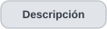
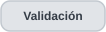
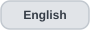
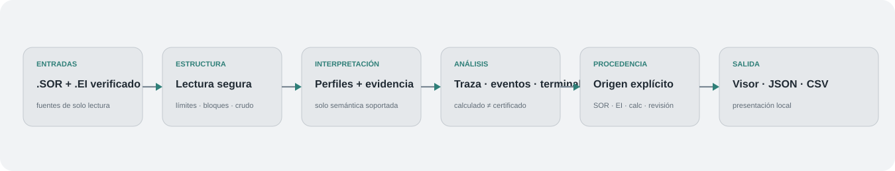

<p align="center">
  <picture>
    <source media="(prefers-color-scheme: dark)" srcset="https://raw.githubusercontent.com/EstebanErazo500/OTDR_Inside/main/assets/otdr-hero.svg">
    <source media="(prefers-color-scheme: light)" srcset="https://raw.githubusercontent.com/EstebanErazo500/OTDR_Inside/main/assets/otdr-hero-light.svg">
    
  </picture>
</p>

<p align="center">
  <strong>Análisis OTDR con evidencia y procedencia explícitas.</strong><br>
  Lectura SOR segura, interpretación por fabricante, reconstrucción de trazas, análisis emparejado EI/SOR y evidencia de eventos calculados sin perder el origen de los datos.
</p>

<p align="center">
  <a href="#descripción-general"></a>
  <a href="#arquitectura"></a>
  <a href="#capacidades-actuales"></a>
  <a href="#alcance-actual"></a>
  <a href="#validación"></a>
  <a href="#hoja-de-ruta"></a>
  <a href="technical-documentation/README.es.md"></a>
</p>

<p align="center">
  <a href="README.md"></a>
  <a href="README.es.md"></a>
</p>

---

<h2 id="descripción-general" align="center">Descripción general</h2>

Los archivos OTDR SOR están diseñados para almacenar mediciones de reflectometría óptica en el dominio del tiempo, pero en condiciones reales no siempre son semánticamente uniformes. Extensiones de fabricante, metadatos reescritos, escalas ambiguas y distintas representaciones de eventos pueden hacer que un archivo sea estructuralmente legible sin que todos sus valores tengan el mismo nivel de confianza.

OTDR Inside aborda este problema separando **estructura**, **interpretación**, **cálculo**, **evidencia** y **procedencia**. El objetivo no es forzar cada traza dentro de un modelo universal, sino mostrar qué se conoce, cómo se obtuvo y qué permanece sin resolver.

<h2 id="arquitectura" align="center">Arquitectura</h2>

<p align="center">
  
</p>

La cadena de procesamiento se divide deliberadamente en capas:

| Capa | Responsabilidad |
|---|---|
| **Lectura estructural** | Lee bloques SOR, revisiones, tamaños, offsets y regiones de muestras con comprobaciones explícitas de límites. |
| **Perfil y normalización** | Aplica reglas específicas de fabricante únicamente cuando la evidencia disponible las respalda. |
| **Análisis de traza y eventos** | Reconstruye la curva, conserva separados los orígenes almacenado/importado/calculado y evalúa evidencia terminal sin inventar magnitudes físicas. |
| **Presentación** | Expone parámetros, estructura, procedencia, eventos y evidencia mediante visor local y exportaciones JSON/CSV. |

Esta separación evita confundir legibilidad estructural con certeza semántica. La evolución versión por versión se documenta en <a href="technical-documentation/architecture.es.md">Documentación técnica</a>.

<h2 id="enfoque-de-ingeniería" align="center">Enfoque de ingeniería</h2>

Cuatro distinciones guían la implementación:

- **La estructura no es la semántica.** Un archivo puede leerse correctamente mientras algunas magnitudes permanecen sin interpretar.
- **El equipo no es necesariamente quien escribió el archivo.** Los bloques propietarios pueden identificar un linaje de software sin demostrar qué OTDR adquirió la traza.
- **Lo almacenado no es lo calculado.** Los valores o eventos añadidos por software de análisis permanecen diferenciados de la información presente en la medición fuente.
- **Desconocido no significa corrupto.** Una semántica no soportada debe permanecer explícita en lugar de ser adivinada silenciosamente.

### Normalización con procedencia

```python
normalized_field = {
    "value": ...,
    "raw_value": ...,
    "unit": ...,
    "source": ...,
    "rule_id": ...,
    "confidence": ...,
    "evidence": ...,
}
```

Así, una conversión empírica, escala específica de fabricante o interpretación inferida permanece diferenciada de un valor almacenado explícitamente.

<h2 id="capacidades-actuales" align="center">Capacidades actuales</h2>

Las entregas de desarrollo documentadas hasta **v0.3.5** integran:

- inspección segura de estructura y metadatos SOR 2.00;
- selección de perfiles caracterizados basada en evidencia;
- reconstrucción de trazas a partir de muestras almacenadas;
- visualización local e interactiva de la curva OTDR;
- lectura defensiva `.EI` para el diseño CE6422 caracterizado y emparejamiento EI/SOR basado en evidencia;
- separación entre eventos almacenados en SOR, información importada de EI, candidatos calculados y revisión manual;
- análisis contextual con supresión explicable y evidencia independiente;
- diagnóstico terminal más un **posible final no reflectivo calculado** solo cuando coinciden varias condiciones de evidencia terminal;
- exportación JSON del modelo de análisis y CSV de eventos;
- manejo seguro de variantes parcialmente soportadas sin modificar la medición fuente.

<h2 id="alcance-actual" align="center">Alcance actual · documentado hasta v0.3.5</h2>

| Ecosistema | Estado | Papel dentro del proyecto |
|---|---|---|
| **EXFO** | **Referencia validada** | Lectura SOR 2.00, parámetros normalizados, eventos almacenados y visualización de trazas para el perfil de referencia caracterizado. |
| **Ceyear CE6422** | **Desarrollo activo** | Interpretación de traza caracterizada, candidatos calculados, emparejamiento EI/SOR verificado para el diseño observado, diagnóstico terminal y finales candidatos respaldados por evidencia. |
| **Yokogawa AQ1000** | **Estructural** | Estructura caracterizada; la normalización semántica específica del fabricante sigue pendiente. |

<p align="center"><strong>estructuralmente legible → perfil identificado → caracterizado semánticamente → validado empíricamente</strong></p>

<h2 id="procedencia-de-eventos" align="center">Procedencia de eventos</h2>

El origen de cada evento permanece dentro del modelo en lugar de aplanarse en una única tabla:

- **SOR almacenado** — información serializada, como `KeyEvents` cuando existe;
- **EI importado** — registros leídos de un diseño EI soportado, conservando explícito el estado de pareja verificada;
- **Candidato calculado** — hipótesis generadas desde la curva reconstruida, incluidos candidatos terminales respaldados;
- **Revisión manual** — estado de revisión/anotación que no altera la medición fuente.

En la familia Ceyear usada durante el desarrollo, ausencia de `KeyEvents` significa que el SOR **no contiene tabla de eventos almacenada**; no significa que la traza óptica no contenga eventos.

<h2 id="validación" align="center">Validación</h2>

La validación se organiza por capas en lugar de reducirse a un único aprobado/fallido:

1. comprobaciones estructurales y de límites;
2. regresión sintética o sanitizada apta para migración pública;
3. regresión privada de perfiles/referencias;
4. verificación de reconstrucción de traza y determinismo;
5. comparación con software de referencia o EI emparejado cuando corresponde;
6. controles positivos/negativos para lógica de eventos y terminal;
7. validación manual del visor local y exportaciones.

El paquete archivado v0.3.5 registra **76 pruebas aprobadas**. Las trazas operativas y corpus privados usados para comparación de ingeniería permanecen fuera de este repositorio público y esas comparaciones no se presentan como validación ciega ni calibración metrológica.

<h2 id="manejo-de-datos" align="center">Manejo de datos</h2>

OTDR Inside está diseñado como un flujo **local y de solo lectura**. Las mediciones fuente se analizan mediante manejo local/temporal y el visor no las sobrescribe.

Este repositorio no distribuye mediciones operativas reales `.sor`, `.ei` u `.otdr`, identificadores de clientes o rutas, ejecutables propietarios de fabricantes, manuales comerciales, estándares licenciados ni derivados que expongan metadatos confidenciales. Los ejemplos y pruebas públicas deben usar datos sintéticos o explícitamente sanitizados.

<h2 id="limitaciones-conocidas" align="center">Limitaciones conocidas</h2>

- El soporte `.EI` se limita al diseño Ceyear observado y caracterizado; no implica compatibilidad EI universal. `.otdr` no forma parte del flujo normal.
- La interpretación específica de fabricante sigue basada en perfiles/firmas y no debe entenderse como compatibilidad SOR universal.
- El nivel vertical mostrado de la traza es relativo y no se presenta como potencia óptica calibrada universalmente.
- Un resultado no reflectivo de v0.3.5 sigue siendo **candidato calculado**: no certifica extremo físico de fibra, pérdida de evento, reflectancia, ORL ni tolerancia metrológica de distancia.
- OTDR Inside no afirma certificación independiente de conformidad con Telcordia SR-4731.
- La semántica no soportada permanece explícitamente sin resolver en lugar de recibir valores especulativos.

<h2 id="hoja-de-ruta" align="center">Hoja de ruta</h2>

- validar clasificación de eventos y terminales frente a referencias independientes adicionales;
- ampliar cobertura de formatos emparejados y fabricantes sin debilitar las reglas de procedencia;
- comparar longitudes de onda emparejadas y comportamiento entre múltiples trazas;
- añadir procesamiento por lotes, detección de duplicados y revisión de anomalías;
- ampliar soporte semántico para nuevos perfiles de fabricante;
- construir una matriz de compatibilidad basada en evidencia de validación reproducible.

<h2 id="autor" align="center">Autor</h2>

<p align="center">
  <strong>Esteban Erazo</strong><br>
  Ingeniería Mecatrónica · Universidad Nacional de Colombia<br><br>
  <a href="https://github.com/EstebanErazo500"></a>
</p>
