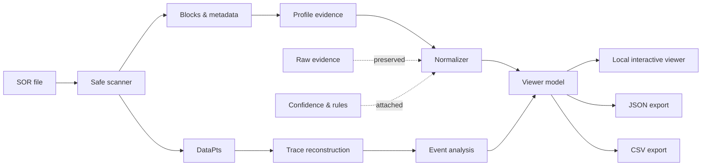

<p align="center">
  
</p>

<h1 align="center">OTDR SOR Analyzer</h1>

<p align="center">
  <strong>From opaque binary traces to explainable fiber insight.</strong>
</p>

<p align="center">
  An evidence-driven toolkit for parsing, reconstructing and analyzing multi-vendor OTDR SOR traces — while keeping raw data, interpretation and confidence explicitly separated.
</p>

<p align="center">
  <code>binary parsing</code> ·
  <code>OTDR traces</code> ·
  <code>vendor profiles</code> ·
  <code>event analysis</code> ·
  <code>data provenance</code> ·
  <code>local-first</code>
</p>

<p align="center">
  <a href="#why-this-project-exists">Why it exists</a> ·
  <a href="#what-it-does">Capabilities</a> ·
  <a href="#architecture">Architecture</a> ·
  <a href="#evidence-before-assumptions">Method</a> ·
  <a href="#current-scope">Scope</a> ·
  <a href="#roadmap">Roadmap</a>
</p>

---

## The hard part is not drawing the curve

An OTDR trace can be easy to plot and surprisingly hard to **trust**.

SOR files are intended to carry optical time-domain reflectometry data, but real-world files may also contain vendor-specific blocks, software-added metadata, ambiguous scales, different event representations and traces that have passed through more than one software ecosystem.

That creates a more interesting engineering problem than simply decoding bytes:

> **What does the file actually contain, what can be interpreted with evidence, and what should remain explicitly unknown?**

OTDR SOR Analyzer approaches that problem as an **evidence pipeline**, not as a collection of assumptions.

```text
           ┌───────────────┐
           │   .SOR file   │
           └───────┬───────┘
                   │
                   ▼
        ┌─────────────────────┐
        │ Structural scanning │
        │ blocks · bounds ·   │
        │ revisions · offsets │
        └──────────┬──────────┘
                   │
          ┌────────┴─────────┐
          ▼                  ▼
 ┌────────────────┐   ┌────────────────┐
 │ Profile clues  │   │   Data points  │
 │ vendor / writer│   │ trace recovery │
 └───────┬────────┘   └───────┬────────┘
         │                    │
         ▼                    ▼
 ┌────────────────┐   ┌────────────────┐
 │ Traceable      │   │ Event analysis │
 │ normalization  │   │ stored /       │
 │                │   │ calculated     │
 └───────┬────────┘   └───────┬────────┘
         └──────────┬─────────┘
                    ▼
          ┌───────────────────┐
          │    Viewer model   │
          └─────────┬─────────┘
                    │
             ┌──────┴──────┐
             ▼             ▼
      Interactive UI    JSON / CSV
```

## Why this project exists

Vendor interoperability around OTDR traces is messy.

A file may be structurally readable without every field being semantically trustworthy. A proprietary block may reveal which software touched a file without proving which instrument originally acquired the optical trace. A reporting application may calculate, add or reinterpret information that was not stored in the same form inside the SOR.

This project was built around that distinction.

Instead of silently forcing every file into one interpretation, the analyzer tries to answer three separate questions:

**Can the structure be read safely?**
**What interpretation is supported by the available evidence?**
**How confident should we be in that interpretation?**

When those answers differ, the software keeps them separate.

---

## What it does

| Layer                    | What the analyzer does                                                                                            |
| ------------------------ | ----------------------------------------------------------------------------------------------------------------- |
| **Structure**            | Scans SOR blocks, revisions, sizes and offsets with boundary checks instead of blindly trusting file contents.    |
| **Identification**       | Uses multiple pieces of evidence to identify supported file profiles and vendor/software lineages.                |
| **Normalization**        | Converts supported raw values while preserving their original representation and the rule used to interpret them. |
| **Trace reconstruction** | Recovers OTDR sample data and reconstructs a distance axis for visualization and analysis.                        |
| **Events**               | Represents event information without treating stored, calculated and inferred values as equivalent.               |
| **Provenance**           | Keeps track of where an interpreted value came from and why a specific rule was applied.                          |
| **Viewer**               | Presents the trace, parameters, events, file structure and provenance through a local interactive interface.      |
| **Export**               | Produces machine-readable JSON and CSV outputs without modifying the source SOR file.                             |

---

## See the trace — and the evidence behind it

<p align="center">
  
</p>

The viewer is deliberately more than a graph.

A trace can be inspected together with the metadata, structural blocks, selected profile, interpretation evidence and event information that produced the displayed result.

That makes the interface useful not only for viewing an OTDR curve, but also for asking:

> **Why is the software showing me this value?**

---

## Evidence before assumptions

A normalized value is not stored as just a number.

The analyzer can preserve its original representation together with the interpretation that produced the displayed value:

```python
normalized_field = {
    "value": ...,
    "raw_value": ...,
    "unit": ...,
    "source": ...,
    "rule_id": ...,
    "confidence": ...,
    "evidence": ...
}
```

This is one of the core design decisions of the project.

It prevents an empirical conversion, vendor-specific scale or inferred meaning from becoming indistinguishable from data that was explicitly stored in the original file.

### Four rules guide the implementation

**Parse safely.**
Malformed or incomplete structures should produce diagnostics, not silent corruption.

**Preserve the evidence.**
Normalization should not erase the original value.

**Interpret by profile, not by resemblance.**
One vendor string or proprietary block is not enough to establish provenance.

**Unknown is a valid result.**
If a semantic interpretation cannot yet be demonstrated, the analyzer should say so.

---

## Architecture

The project separates structural parsing from semantic interpretation.



The separation is intentional:

```text
structure ≠ semantics
equipment ≠ file writer
stored value ≠ displayed value
stored event ≠ calculated event
unknown ≠ corrupt
```

Those distinctions become especially important when files have been acquired by one instrument, rewritten by another software package or interpreted later by a reporting tool.

---

## Local-first by design

OTDR SOR Analyzer is designed to work locally.

Source traces are treated as read-only inputs. The application analyzes temporary copies instead of overwriting the original measurement, and the normal workflow does not require uploading operational traces to an external service.

That choice is both practical and deliberate: optical network measurements may contain information that should never become part of a public dataset or repository.

Accordingly, this repository does **not** distribute real operational traces, customer identifiers or proprietary vendor software.

---

## Current scope

The current development line is **v0.3.x**.

The project has evolved from structural SOR inspection into a larger analysis pipeline covering safe parsing, vendor-aware interpretation, trace reconstruction, provenance and event-oriented analysis.

Development has involved files associated with multiple OTDR ecosystems, including **EXFO, Ceyear and Yokogawa**, but compatibility is intentionally not presented as a binary “supported / unsupported” claim.

Instead, support is treated as a level of demonstrated knowledge:

```text
STRUCTURAL
    ↓
PROFILE IDENTIFIED
    ↓
SEMANTICALLY CHARACTERIZED
    ↓
EMPIRICALLY VALIDATED
```

A structurally readable file may therefore remain available for inspection even when some vendor-specific magnitudes are deliberately left uninterpreted.

---

## What this project does not claim

This project is an engineering and research prototype.

It does not claim universal compatibility with every SOR implementation, and it does not claim independent certification of compliance with Telcordia SR-4731.

Vendor-specific interpretations are promoted only when supported by reproducible evidence.

That limitation is a feature of the methodology, not something hidden behind the interface.

---

## Validation philosophy

Real-world compatibility work is tested at several levels:

```text
synthetic fixtures
       │
       ▼
parser / boundary tests
       │
       ▼
profile regression
       │
       ▼
trace reconstruction
       │
       ▼
reference comparison
       │
       ▼
manual viewer validation
```

Public tests are intended to rely on synthetic or sanitized fixtures.

Operational traces used during engineering validation remain outside the repository.

---

## Engineering highlights

* Defensive parsing of binary SOR structures with explicit bounds checking.
* Preservation of unknown and proprietary blocks instead of silently discarding them.
* Evidence-based profile selection instead of vendor detection by a single signature.
* Provenance-aware normalized fields.
* OTDR curve reconstruction from stored sample data.
* Interactive local trace visualization.
* Explicit separation between stored, normalized, calculated and unknown information.
* Graceful handling of partially supported file variants.
* JSON and CSV exports designed for further engineering analysis.
* Regression-oriented development against observed real-world variants without publishing the underlying operational measurements.

---

## Roadmap

The long-term direction is not “support every file by guessing harder”.

It is to progressively expand the set of **demonstrated interpretations**.

```text
multi-vendor characterization
           ↓
stronger event detection
           ↓
cross-wavelength comparison
           ↓
batch analysis
           ↓
duplicate / anomaly detection
           ↓
compatibility & confidence matrix
```

Each new interpretation should come with the evidence required to explain why it is trusted.

---

## Repository data policy

Real `.sor`, `.ei` and other operational OTDR measurements are intentionally excluded from this repository.

Vendor executables, commercial manuals and licensed technical standards are also not redistributed.

Examples and automated tests should use synthetic or explicitly sanitized data.

---

## Author

**Esteban Erazo**
Mechatronics Engineering
Universidad Nacional de Colombia

GitHub: [@EstebanErazo500](https://github.com/EstebanErazo500)

---

<p align="center">
  <sub>
    When the file is ambiguous, the software should be explicit.
  </sub>
</p>
