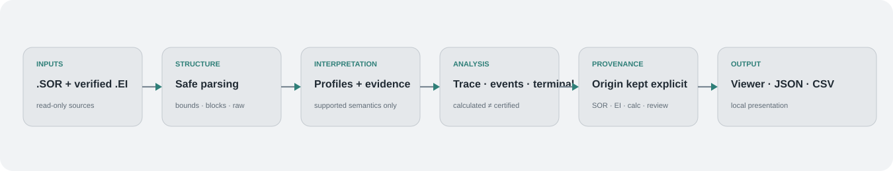

<p align="center">
  <picture>
    <source media="(prefers-color-scheme: dark)" srcset="https://raw.githubusercontent.com/EstebanErazo500/OTDR_Inside/main/assets/otdr-hero.svg">
    <source media="(prefers-color-scheme: light)" srcset="https://raw.githubusercontent.com/EstebanErazo500/OTDR_Inside/main/assets/otdr-hero-light.svg">
    
  </picture>
</p>

<p align="center">
  <strong>Evidence-aware analysis of OTDR SOR traces.</strong><br>
  Safe binary parsing, multi-vendor interpretation, trace reconstruction and event analysis without losing data provenance.
</p>

<p align="center">
  <a href="#overview"></a>
  <a href="#architecture"></a>
  <a href="#current-capabilities"></a>
  <a href="#current-scope"></a>
  <a href="#validation"></a>
  <a href="#roadmap"></a>
</p>

<p align="center">
  <a href="README.md"></a>
  <a href="README.es.md"></a>
</p>

---

<h2 id="overview" align="center">Overview</h2>

OTDR SOR files are designed to store optical time-domain reflectometry measurements, but real-world files are not always semantically uniform. Vendor extensions, rewritten metadata, ambiguous scales and different event representations can make a file structurally readable without making every value equally trustworthy.

OTDR Inside addresses that problem by separating **structure**, **interpretation**, **calculation** and **confidence**. The goal is not to force every trace into a universal model, but to expose what is known, how it was derived and what remains unresolved.

<h2 id="architecture" align="center">Architecture</h2>

<p align="center">
  
</p>

The pipeline is deliberately layered:

| Layer | Responsibility |
|---|---|
| **Structural parsing** | Reads SOR blocks, revisions, sizes, offsets and sample regions with explicit boundary checks. |
| **Profile & normalization** | Applies vendor-aware rules only when the available evidence supports them. |
| **Trace analysis** | Reconstructs the distance axis and curve, then handles stored and calculated event information separately. |
| **Presentation** | Exposes parameters, structure, provenance and events through a local viewer and JSON/CSV exports. |

This separation prevents structural readability from being mistaken for semantic certainty.

<h2 id="engineering-approach" align="center">Engineering approach</h2>

Four distinctions guide the implementation:

- **Structure is not semantics.** A file can be parsed safely while some magnitudes remain uninterpreted.
- **Equipment is not necessarily the file writer.** Proprietary blocks may identify a software lineage without proving which OTDR acquired the trace.
- **Stored is not calculated.** Values or events added by analysis software remain distinguishable from information present in the original SOR.
- **Unknown is not corrupt.** Unsupported semantics should remain explicit instead of being silently guessed.

### Provenance-aware normalization

Normalized fields retain the evidence required to explain their displayed value:

```python
normalized_field = {
    "value": ...,
    "raw_value": ...,
    "unit": ...,
    "source": ...,
    "rule_id": ...,
    "confidence": ...,
    "evidence": ...,
}
```

This allows an empirical conversion, vendor-specific scale or inferred meaning to remain distinguishable from a value explicitly stored in the file.

<h2 id="current-capabilities" align="center">Current capabilities</h2>

The current development line combines:

- safe inspection of SOR 2.00 block structure and metadata;
- evidence-based selection of supported vendor profiles;
- trace reconstruction from stored sample data;
- interactive local visualization of the OTDR curve;
- display of parameters, file structure and interpretation provenance;
- separation of stored events from calculated event candidates;
- JSON export of the analysis model and CSV export of event data;
- graceful handling of partially supported variants without modifying the source trace.

<h2 id="current-scope" align="center">Current scope · v0.3.x</h2>

| Ecosystem | Status | Role in the project |
|---|---|---|
| **EXFO** | **Validated reference** | SOR 2.00 parsing, normalized parameters, stored events and trace visualization. |
| **Ceyear CE6422** | **Active development** | Trace interpretation and calculated event detection when `KeyEvents` is absent. |
| **Yokogawa AQ1000** | **Structural** | File structure characterized; vendor-specific semantic normalization remains pending. |

<p align="center">
  <strong>structurally readable → profile identified → semantically characterized → empirically validated</strong>
</p>

<h2 id="event-provenance" align="center">Event provenance</h2>

Event handling is one of the main differences between the early reader and the current analysis pipeline.

A `KeyEvents` table is treated as **stored event information**. Events proposed from the reconstructed curve are treated as **calculated candidates** and retain that origin in the model and exports.

This distinction is particularly important for Ceyear files used during development: the absence of `KeyEvents` means that the SOR contains **no stored event table**; it does not demonstrate that the optical trace itself contains no events.

<h2 id="validation" align="center">Validation</h2>

Validation is performed at several levels rather than through a single pass/fail criterion:

1. structural and boundary checks;
2. synthetic or sanitized tests for public regression;
3. profile regression against private reference traces;
4. trace reconstruction checks;
5. comparison with reference software where appropriate;
6. manual validation of the local viewer.

Operational measurements used for engineering validation remain outside the public repository.

<h2 id="data-handling" align="center">Data handling</h2>

OTDR Inside is designed as a **local, read-only workflow**. Source traces are analyzed from temporary copies and are not overwritten by the viewer.

This repository does not distribute real operational `.sor`, `.ei` or `.otdr` measurements, customer or route identifiers, proprietary vendor executables, commercial manuals, licensed standards, or derived files that expose confidential trace metadata. Public examples and tests should rely on synthetic or explicitly sanitized data.

<h2 id="known-limitations" align="center">Known limitations</h2>

- The current viewer works with `.SOR`; `.EI` and `.otdr` are not yet part of the normal processing path.
- Vendor-specific interpretation is profile-based and should not be read as universal SOR compatibility.
- The displayed vertical trace level is relative and is not presented as universally calibrated optical power.
- OTDR Inside does not claim independent certification of Telcordia SR-4731 compliance.
- Unsupported vendor semantics remain explicitly unresolved rather than being assigned speculative values.

<h2 id="roadmap" align="center">Roadmap</h2>

- improve event detection and confidence criteria;
- compare paired wavelengths and multi-trace behavior;
- add batch processing, duplicate detection and anomaly review;
- expand semantic support for additional vendor profiles;
- build a compatibility matrix based on reproducible validation evidence.

<h2 id="author" align="center">Author</h2>

<p align="center">
  <strong>Esteban Erazo</strong><br>
  Mechatronics Engineering · Universidad Nacional de Colombia<br>
  <a href="https://github.com/EstebanErazo500">@EstebanErazo500</a>
</p>
