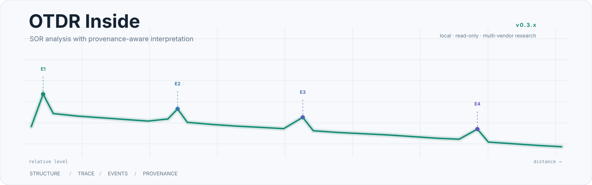

  <picture>
    <source media="(prefers-color-scheme: dark)" srcset="assets/otdr-hero.svg">
    <source media="(prefers-color-scheme: light)" srcset="assets/otdr-hero-light.svg">
    
  </picture>

<h1 align="center">OTDR Inside</h1>

  <strong>Read the trace. Trace the evidence.</strong> 
  A local SOR analysis toolkit that separates what a trace stores, what can be interpreted, and what is calculated from it.

  <strong>English</strong> · <a href="README.es.md">Español</a>

---

## What is OTDR Inside?

Plotting an OTDR curve is easy. **Knowing what can actually be trusted is not.**

Real SOR files mix standard structures with vendor extensions, rewritten metadata, ambiguous scales and different event representations. OTDR Inside treats that as an evidence problem: it parses safely, reconstructs the trace, applies vendor-aware rules only when supported, and preserves the origin and confidence of interpreted values.

> **Unknown is a valid result.** The analyzer should not turn uncertainty into a number just because a field exists.

  <picture>
    <source media="(prefers-color-scheme: dark)" srcset="assets/architecture-dark.svg">
    <source media="(prefers-color-scheme: light)" srcset="assets/architecture-light.svg">
    
  </picture>

## What makes it different

| Principle | In practice |
|---|---|
| **Safe binary parsing** | SOR blocks, sizes and offsets are checked before they are trusted. |
| **Traceable interpretation** | Raw value, normalized value, rule, source and confidence stay linked. |
| **Event provenance** | Stored events and calculated event candidates are never presented as equivalent. |
| **Local & read-only** | Operational traces are analyzed locally from temporary copies; originals are not overwritten. |

The project deliberately keeps a few distinctions visible:

  <code>structure ≠ semantics</code> ·
  <code>equipment ≠ file writer</code> ·
  <code>stored ≠ calculated</code> ·
  <code>unknown ≠ corrupt</code>

## Current scope · v0.3.x

| Ecosystem | Status | Current role |
|---|---|---|
| **EXFO** | **Validated reference** | SOR 2.00 parsing, normalized parameters, stored events and trace visualization. |
| **Ceyear CE6422** | **Active development** | Trace interpretation and calculated event detection when `KeyEvents` is absent. |
| **Yokogawa AQ1000** | **Structural** | File structure characterized; vendor-specific semantic normalization remains pending. |

Support is intentionally progressive rather than a simple yes/no label: **readable → identified → characterized → validated**.

## Event analysis without hiding the source

The current development line makes event provenance explicit. If a SOR contains `KeyEvents`, those events remain **stored** events. If the curve is analyzed to propose additional events, they remain **calculated candidates**.

That matters especially for Ceyear files where the absence of `KeyEvents` means *“no stored event table”* — not *“no events exist.”*

## Validation

The project combines synthetic/sanitized tests with regression over private reference traces:

**boundary checks → profile regression → trace reconstruction → reference comparison → manual viewer validation**

Operational traces used for engineering validation remain outside the public repository.

## Roadmap

- Strengthen event detection and confidence criteria.
- Compare paired wavelengths and multi-trace behavior.
- Add batch analysis, duplicate detection and anomaly review.
- Expand the compatibility matrix only when new interpretations are reproducibly validated.

<strong>Methodological safeguards</strong>

- Incomplete or malformed structures produce diagnostics instead of silent corruption.
- Unknown or proprietary blocks are preserved rather than discarded automatically.
- A single vendor string or proprietary marker is not enough to establish provenance.
- OTDR Inside does not claim universal SOR compatibility or independent certification of Telcordia SR-4731 compliance.

<strong>Repository data policy</strong>

This public repository does not distribute real operational `.sor`, `.ei` or `.otdr` measurements, customer or route identifiers, proprietary vendor executables, commercial manuals, licensed standards, or derived files exposing confidential trace metadata. Public examples and tests should use synthetic or explicitly sanitized data.

## Author

**Esteban Erazo**  
Mechatronics Engineering · Universidad Nacional de Colombia  
GitHub: [@EstebanErazo500](https://github.com/EstebanErazo500)

  When the file is ambiguous, the software should be explicit.

