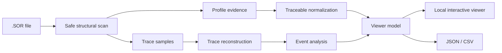

<p align="center">
  
</p>

<h1 align="center">OTDR Inside</h1>

<p align="center">
  <strong>Read the trace. Trace the evidence.</strong>
</p>

<p align="center">
  A local, evidence-aware toolkit for reading OTDR SOR files, reconstructing traces and separating what is stored, interpreted and calculated.
</p>

<p align="center">
  <strong>English</strong> · <a href="README.es.md">Español</a>
</p>

<p align="center">
  <code>SOR parsing</code> · <code>OTDR traces</code> · <code>event analysis</code> · <code>provenance</code> · <code>multi-vendor</code> · <code>local-first</code>
</p>

---

## One trace can tell several different stories

Plotting an OTDR curve is the easy part.

The harder part is deciding what can actually be trusted.

Real SOR files may contain standard blocks, vendor-specific extensions, software-added metadata, ambiguous scales and event information that changes depending on the ecosystem that wrote or later interpreted the file.

**OTDR Inside is built around one rule:** never present an interpretation as stronger than the evidence behind it.

That means the project keeps these concepts deliberately separate:

```text
file structure        ≠ semantic meaning
acquisition equipment ≠ file writer
stored value          ≠ displayed value
stored event          ≠ calculated event
unknown               ≠ corrupt
```

This distinction is the core of the project.

---

## What OTDR Inside does

OTDR Inside turns a SOR file into an inspectable analysis pipeline:



### Core capabilities

| Capability | What it means in practice |
|---|---|
| **Safe SOR scanning** | Reads block layout, revisions, sizes and offsets with boundary checks instead of blindly trusting the file. |
| **Evidence-based profiling** | Uses multiple signals to characterize vendor/software lineages instead of assigning a profile from one string or block. |
| **Traceable normalization** | Keeps the raw value, interpreted value, source, rule and confidence together. |
| **Trace reconstruction** | Recovers OTDR sample data and builds the distance axis used by the viewer and analysis pipeline. |
| **Event-aware analysis** | Keeps stored events and calculated candidates distinguishable instead of flattening them into one table. |
| **Local viewer** | Presents trace, parameters, structure, provenance and events without sending operational traces to an external service. |
| **Export** | Produces JSON and CSV outputs for further engineering analysis while leaving the original SOR untouched. |

---

## Evidence is part of the data model

A normalized field is not treated as just a number.

```python
normalized_field = {
    "value": ...,
    "raw_value": ...,
    "unit": ...,
    "source": ...,
    "rule_id": ...,
    "confidence": ...,
    "evidence": ...
}
```

This prevents a vendor-specific conversion, empirical scale or inferred meaning from becoming indistinguishable from information explicitly stored in the file.

The implementation follows four practical rules:

- **Parse safely.** Incomplete or malformed structures should produce diagnostics, not silent corruption.
- **Preserve the evidence.** Normalization must not erase the original representation.
- **Interpret by profile, not resemblance.** One proprietary marker is not enough to establish provenance.
- **Unknown is a valid result.** If a semantic interpretation cannot be demonstrated yet, the software should say so.

---

## Current development line

The current development line is **v0.3.x**.

At this stage, the project is no longer just a SOR reader. It combines structural parsing, vendor-aware interpretation, curve reconstruction, provenance and event-oriented analysis.

The current research and validation work has covered files associated with several OTDR ecosystems:

| Ecosystem | Current role in the project |
|---|---|
| **EXFO** | Main validated reference for SOR 2.00 parsing, normalized parameters, stored events and trace visualization. |
| **Ceyear CE6422** | Active line for trace interpretation and calculated event detection when the SOR does not contain `KeyEvents`. |
| **Yokogawa AQ1000** | Structurally characterized; vendor-specific semantic normalization remains a later integration step. |

Support is intentionally not reduced to a simple “yes/no” label. A file can be structurally readable even when some vendor-specific meanings remain unvalidated.

```text
STRUCTURALLY READABLE
        ↓
PROFILE IDENTIFIED
        ↓
SEMANTICALLY CHARACTERIZED
        ↓
EMPIRICALLY VALIDATED
```

---

## Why the event layer matters

One of the most important changes in the current development line is the separation of **event provenance**.

An event shown by an OTDR workflow can come from different places:

- stored directly in the SOR file,
- calculated from the reconstructed curve,
- imported from another vendor format,
- or eventually added manually during review.

OTDR Inside does not assume those sources are equivalent.

For example, some Ceyear SOR files used during development do not include `KeyEvents`. The correct conclusion is therefore not “there are no events”, but rather **“the SOR does not contain a stored event table.”** The current development line adds event candidates derived from the trace while keeping their calculated origin explicit.

---

## Local-first, read-only by design

Operational OTDR traces can contain information that should not become public data.

For that reason, the analyzer is designed to work locally and to treat source traces as read-only inputs. The normal workflow analyzes temporary copies instead of overwriting the original measurement.

This repository therefore does **not** distribute:

- real operational `.sor`, `.ei` or `.otdr` files,
- customer or route identifiers,
- proprietary vendor executables,
- commercial manuals,
- licensed technical standards,
- or derived files that expose confidential trace metadata.

Public examples and automated tests should rely on synthetic or explicitly sanitized data.

---

## Architecture in one sentence

**Structure first, interpretation second, confidence always attached.**

The project deliberately separates low-level parsing from vendor-specific semantics so that an unknown file can still be inspected without pretending that every field has already been understood.

---

## What this project does not claim

OTDR Inside is an engineering and research prototype.

It does **not** claim universal compatibility with every SOR implementation and does **not** claim independent certification of compliance with Telcordia SR-4731.

Vendor-specific interpretations are promoted only when there is enough reproducible evidence to explain why they are trusted.

---

## Validation approach

The project uses several layers of validation rather than one all-or-nothing test:

```text
synthetic / sanitized fixtures
            ↓
parser and boundary checks
            ↓
profile regression
            ↓
trace reconstruction
            ↓
comparison with reference tools
            ↓
manual viewer validation
```

Operational validation traces remain outside the public repository.

---

## Engineering highlights

- Defensive binary parsing with explicit bounds checking.
- Preservation of unknown and proprietary blocks instead of silently discarding them.
- Evidence-based profile selection.
- Provenance-aware normalization.
- OTDR curve reconstruction from stored sample data.
- Explicit separation between stored and calculated event information.
- Local interactive visualization.
- Graceful degradation for partially supported variants.
- JSON and CSV exports for further analysis.
- Regression-oriented development against real-world variants without publishing the underlying operational measurements.

---

## Roadmap

The goal is not to “support every file by guessing harder”.

The goal is to expand the set of **demonstrated interpretations**:

```text
stronger event detection
        ↓
cross-wavelength comparison
        ↓
batch analysis
        ↓
duplicate / anomaly detection
        ↓
compatibility & confidence matrix
        ↓
more validated vendor profiles
```

Each new interpretation should come with enough evidence to explain why it is trusted.

---

## Author

**Esteban Erazo**  
Mechatronics Engineering · Universidad Nacional de Colombia  
GitHub: [@EstebanErazo500](https://github.com/EstebanErazo500)

<p align="center">
  <sub>When the file is ambiguous, the software should be explicit.</sub>
</p>
