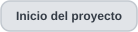

<h1 align="center">Historial de versiones</h1>

  
  

  
  

> Este historial público se reconstruye a partir de entregas archivadas del desarrollo. Documenta la secuencia técnica real, pero **no** pretende que esas entregas hayan sido originalmente commits de Git. Las etiquetas públicas se añadirán a medida que avance la migración sanitizada del código.

## Evolución general

| Versión | Enfoque de ingeniería | Cambio principal |
|---|---|---|
| **v0.1.0** | Primera rebanada vertical | Lectura SOR segura, interpretación por perfiles, reconstrucción de traza, visor local, eventos EXFO almacenados, exportación JSON/CSV y pruebas automáticas. |
| **v0.1.1** | Robustez de arranque en Windows | Diagnóstico de inicio, comprobación de versión de Python y selección automática de puertos alternativos. |
| **v0.1.2** | Compatibilidad con seguridad de Windows | Se retiraron lanzadores de shell y el inicio pasó a una tarea de VS Code compatible con Smart App Control; el motor SOR y los perfiles permanecieron sin cambios. |
| **v0.2.0** | Caracterización de curva Ceyear | Los ejes de la curva CE6422 se validaron contra software de referencia; se añadieron evidencia por capacidad y límites semánticos explícitos. |
| **v0.3.0** | Candidatos de evento calculados | Se añadió detección experimental de eventos desde la curva Ceyear conservando la procedencia almacenado/calculado y las muestras serializadas crudas. |
| **v0.3.1** | Evidencia y revisión humana | Ventanas de evidencia exportables, ruido/contexto local y flujo explícito de revisión pendiente/aceptado/descartado. |
| **v0.3.2** | Detector híbrido contextual | Persistencia, polaridad, contexto de recuperación y lógica terminal; los candidatos suprimidos permanecen explicables en los diagnósticos exportados. |
| **v0.3.3** | Análisis emparejado EI/SOR | Lectura defensiva de `.EI`, emparejamiento estricto por muestras complementarias y metadatos, y procedencia separada para información EI. |
| **v0.3.4** | Diagnóstico terminal y localización | Región terminal D1 navegable, localización experimental multiescala y regresión específica del comportamiento terminal. |
| **v0.3.5** | Finales no reflectivos con evidencia | Una etapa terminal independiente puede promover una transición de ruido suficientemente respaldada a candidato calculado y revisable; si falta evidencia, permanece como diagnóstico D. |

## Fase 1 — Base estructural estable

### v0.1.0

La primera entrega archivada ya constituía una rebanada vertical completa y no un simple experimento de parser. Incluía:

- apertura local y de solo lectura de archivos `.SOR`;
- inspección estructural mediante el mapa SOR y bloques nombrados;
- selección explícita de perfiles según la evidencia disponible;
- perfil EXFO FTB-7200D utilizado como referencia validada;
- reconstrucción completa de la traza y visualización interactiva;
- eventos EXFO almacenados superpuestos sobre la curva;
- vistas de parámetros de adquisición, identificación, estructura y procedencia;
- exportación JSON del análisis y CSV de eventos;
- perfil preliminar Ceyear CE6422;
- degradación controlada cuando no existe un perfil semántico validado.

El changelog archivado de v0.1.0 registra **23 pruebas automáticas aprobadas**.

### v0.1.1

El motor de análisis se mantuvo esencialmente igual. El desarrollo se desplazó hacia la robustez operativa en Windows:

- diagnóstico de arranque;
- comprobación explícita de Python 3.11+;
- fallos visibles en lugar de cerrar la terminal inmediatamente;
- prueba de puertos locales adicionales cuando el puerto predeterminado estaba ocupado.

### v0.1.2

El siguiente cambio fue de despliegue, no de análisis. Se retiraron los lanzadores de shell y el inicio pasó a una tarea integrada de VS Code para coexistir con Windows Smart App Control sin pedir al usuario desactivar controles de seguridad.

El changelog archivado indica explícitamente que el **motor SOR, los perfiles y las reglas de solo lectura permanecieron sin cambios**.

## Fase 2 — La semántica de fabricante se vuelve explícita

### v0.2.0

El soporte Ceyear pasó de una compatibilidad estructural preliminar a un perfil de curva caracterizado empíricamente.

La entrega archivada documenta:

- validación de los ejes horizontal y vertical frente a software de referencia mediante archivos controlados;
- regresiones opcionales sobre un corpus privado Ceyear más amplio sin empaquetar esas trazas con el código;
- estado por capacidad en lugar de una única etiqueta binaria “soportado / no soportado”;
- separación entre alcance nominal y extensión de muestras;
- reconocimiento explícito de que la información de eventos visible en el software de referencia no necesariamente estaba serializada como `KeyEvents` en los SOR observados;
- nivel relativo recuperado para la traza, sin presentarlo como potencia óptica calibrada universalmente;
- evidencia asociada a las capacidades normalizadas dentro del JSON exportado.

Esta versión marca el punto donde **legibilidad estructural y certeza semántica pasan a ser conceptos deliberadamente separados en el modelo del producto**.

## Fase 3 — Análisis de eventos con procedencia

### v0.3.0

La línea 0.3 comienza con análisis de eventos calculados sobre la familia de trazas Ceyear caracterizada.

Entre los cambios principales están:

- detector experimental de picos y transiciones persistentes de nivel;
- distinción explícita entre la región serializada de muestras y la región útil para análisis;
- candidatos calculados separados de los eventos almacenados en el SOR original;
- selección de candidatos sincronizada con el visor;
- anotaciones manuales con historial;
- magnitudes diagnósticas relativas en lugar de valores físicos inventados;
- servicio local restringido a `127.0.0.1`.

### v0.3.1

En lugar de sustituir el detector base solo porque otros umbrales producían resultados distintos, v0.3.1 conservó el generador de 0.3.0 cuando las alternativas probadas no mejoraron las referencias disponibles.

La versión añadió una **capa de evidencia**:

- varios tamaños y posiciones de ventana;
- medidas de ruido local;
- contexto vecino y motivos;
- ventanas anterior/posterior resaltadas en el visor;
- estado de revisión humana separado (`pendiente`, `aceptado`, `descartado`) con comentario e historial;
- exportación de evidencia y estado de revisión.

Esta separación es importante: detección automática y validación humana se representan como información diferente.

### v0.3.2

El detector híbrido amplió la base con lógica contextual:

- polaridad del evento;
- persistencia local;
- contexto de recuperación;
- región terminal/ruido separada;
- número limitado de propuestas adicionales de cambio persistente;
- candidatos rechazados o suprimidos conservados con la regla y el vector de características que explican la decisión.

La comparación de desarrollo registrada en la entrega archivada muestra una mejor recuperación de las referencias intermedias disponibles, pero declara expresamente que esas referencias **no eran datos ciegos de evaluación**. Esa limitación se conserva en el historial público y no se transforma en una afirmación de exactitud.

## Fase 4 — Formatos emparejados y razonamiento terminal

### v0.3.3

Esta versión introdujo lectura defensiva de `.EI` y análisis conjunto EI/SOR.

Una pareja no se acepta únicamente por el nombre del archivo. La implementación archivada exige concordancia entre metadatos de adquisición y la relación complementaria esperada entre muestras para la familia de exportación Ceyear caracterizada.

El modelo también separa el origen de los eventos en categorías distintas, entre ellas:

- información almacenada en el SOR;
- información importada desde una pareja EI verificada;
- candidatos calculados desde la curva;
- revisión o anotación manual.

La firma de exportación Ceyear se amplió desde un archivo exacto hacia la familia estructural comprobada, manteniendo los valores crudos y la semántica no soportada sin inventar.

### v0.3.4

Esta entrega introdujo una capa de diagnóstico terminal más explícita:

- **región terminal D1** visible y navegable, distinta de los candidatos físicos y de la comparación EI;
- exportaciones CSV/JSON coherentes con el modelo de diagnóstico y localización;
- experimento de localización de rampa multiescala evaluado sin reemplazar las posiciones principales cuando no superó la comparación controlada;
- regresión dedicada al comportamiento terminal, determinismo y reducción gráfica.

El código de localización distingue expresamente la dispersión multiescala como **sensibilidad del algoritmo, no como intervalo estadístico de confianza**.

### v0.3.5

v0.3.5 avanza desde mostrar una transición terminal únicamente como marcador diagnóstico hacia una etapa separada de **evidencia de final no reflectivo**. Esa etapa puede producir un candidato calculado cuando varias observaciones independientes coinciden.

La implementación archivada exige, en conjunto:

- un cambio estable del comportamiento de primera diferencia/ruido a través de tres ventanas de localización;
- ruido elevado y persistente en el tramo posterior, no una ráfaga breve;
- un descenso relativo adicional respecto a la tendencia previa en varias escalas de contexto;
- ausencia de un candidato de final reflectivo ya seleccionado.

Si no se cumplen todos los requisitos, la región terminal permanece como **marcador diagnóstico D** en lugar de promoverse a evento. Si se cumplen, el candidato puede seleccionarse, revisarse y exportarse, pero sigue sin inventar pérdida de evento o reflectancia y no se presenta como extremo físico certificado de la fibra.

La versión también hace más localizada la exclusión automática en la vecindad terminal, comparando respuestas cercanas con el ruido local, y conserva deliberadamente el dominio de búsqueda suplementaria ya establecido para evitar que nuevas propuestas terminales desplacen candidatos anteriores solo por el límite de propuestas.

La regresión se amplió con controles sintéticos positivos y negativos además de material privado de campo y referencia. El registro archivado de la suite reporta **76 pruebas aprobadas**. Las comparaciones con el corpus privado de desarrollo se consideran evidencia de desarrollo, no validación ciega ni calibración metrológica; los nuevos finales candidatos fuera de las referencias controladas siguen requiriendo revisión frente a evidencia de fabricante o referencia.

El nuevo módulo `terminal.py` concentra la lógica de evidencia para final no reflectivo, dejando sin cambios la lectura estructural, la normalización por perfiles y la reconstrucción de traza.

## Qué permaneció estable

Dos componentes importantes de la base son idénticos byte a byte en todas las entregas archivadas desde **v0.1.0 hasta v0.3.5**:

- `scanner.py` — escáner estructural SOR;
- `exfo_ftb7200_sor2.json` — perfil EXFO utilizado como referencia validada.

`normalizer.py` y `trace.py` también permanecen sin cambios entre v0.3.4 y v0.3.5. El trabajo de 0.3.5 se concentra en razonamiento terminal/eventos, evidencia, presentación y regresión, no en la frontera SOR cruda.

## Política de migración pública

El historial Git de este repositorio se reconstruirá a partir de estas entregas archivadas bajo las siguientes restricciones:

1. las mediciones operativas `.SOR`, `.EI` y `.otdr` nunca se incorporan a Git;
2. rutas privadas, números de serie, nombres de corpus, hashes y rutas internas se eliminan o generalizan;
3. no se redistribuyen programas propietarios de fabricantes, estándares licenciados ni manuales comerciales;
4. la regresión pública utiliza fixtures sintéticos o explícitamente sanitizados;
5. las etiquetas representan estados históricos sanitizados, no fechas de commit originales inventadas.

La secuencia pública actualmente documentada es:

`v0.1.0 → v0.1.1 → v0.1.2 → v0.2.0 → v0.3.0 → v0.3.1 → v0.3.2 → v0.3.3 → v0.3.4 → v0.3.5`

Esta secuencia continuará a medida que se incorporen entregas posteriores.

---

  
  

